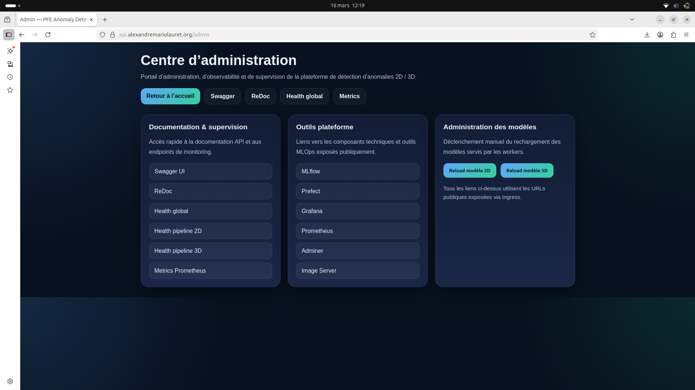
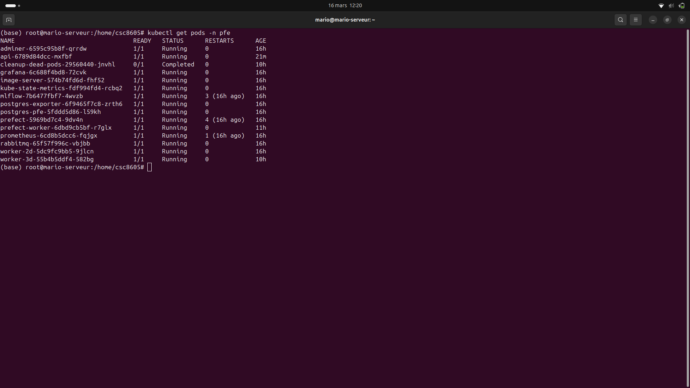
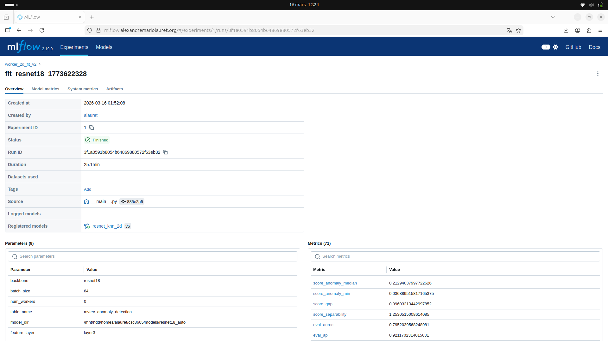
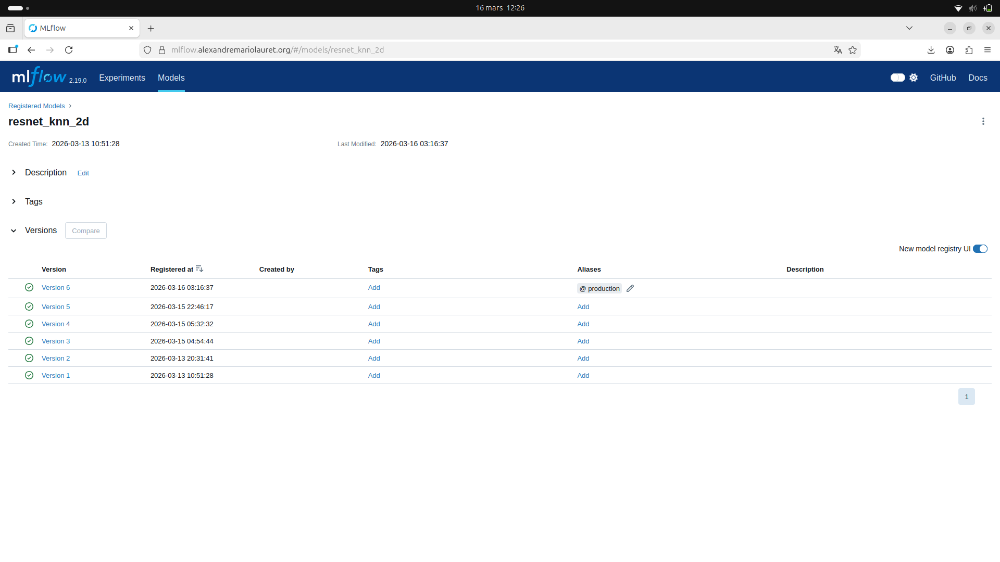
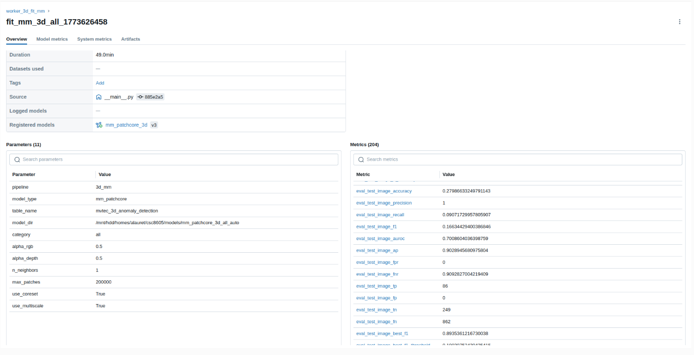
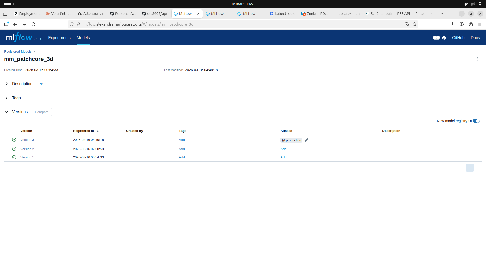
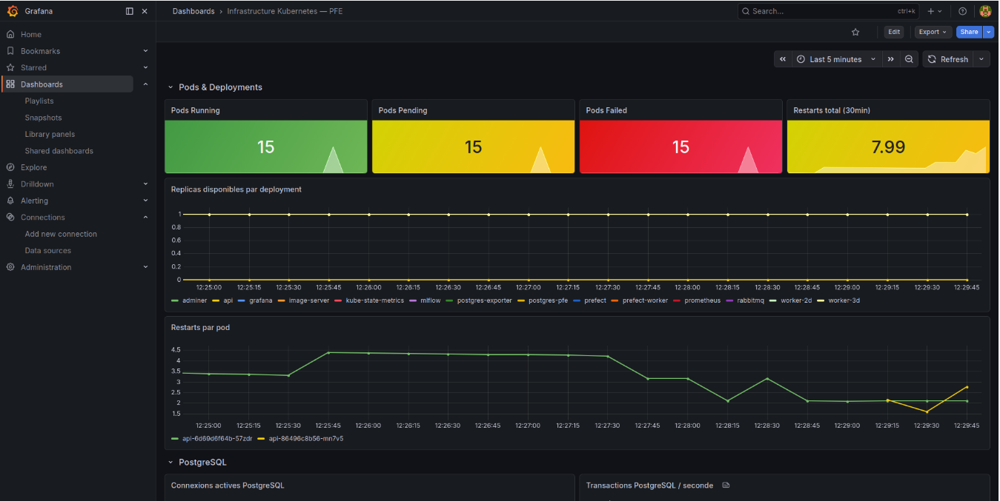
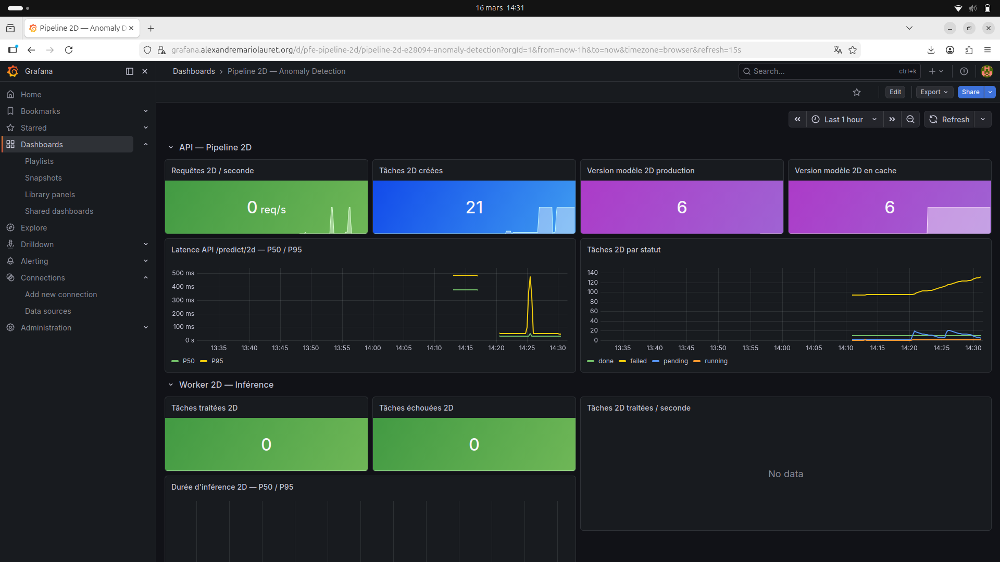
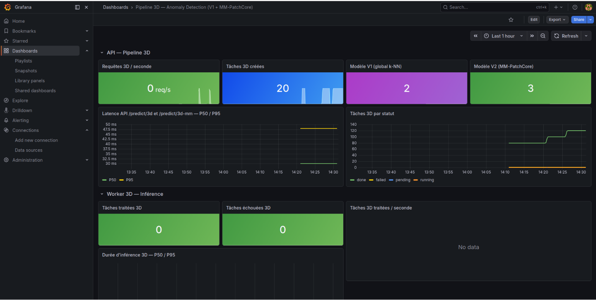

# Détection d'Anomalies Industrielles 2D / 3D

Plateforme MLOps de détection d'anomalies sur des images industrielles, combinant un pipeline **2D** (PatchCore ResNet18) évalué sur [MVTec AD](https://www.mvtec.com/company/research/datasets/mvtec-ad) et un pipeline **3D multimodal** (Multimodal PatchCore RGB + Depth) évalué sur [MVTec 3D-AD](https://www.mvtec.com/company/research/datasets/mvtec-3d-ad).

Le système expose une **API REST** permettant de soumettre des images, traite les prédictions de manière **asynchrone** via RabbitMQ, et orchestre l'entraînement sur un **cluster HPC (Slurm)** piloté par **Prefect**. Le suivi des expériences est assuré par **MLflow**, le monitoring par **Prometheus + Grafana**, et l'ensemble est déployé sur **Kubernetes (k3s)**.

> **Projet de Fin d'Études** — Télécom SudParis — CSC8605

---

## Architecture globale

```
┌─────────────────────────────────────────────────────────────────────┐
│                        KUBERNETES (k3s)                             │
│                                                                     │
│  ┌────────────┐     ┌──────────┐     ┌────────────┐                 │
│  │  FastAPI   │────▶│ RabbitMQ │────▶│ Worker 2D  │                 │
│  │   (API)    │     │          │     │ (PatchCore)│                 │
│  │            │     │          │     └────────────┘                 │
│  │ /predict/2d│     │          │     ┌────────────┐                 │
│  │ /predict/3d│     │          │────▶│ Worker 3D  │                 │
│  └─────┬──────┘     └──────────┘     │(MM-PCore)  │                 │
│        │                             └─────┬──────┘                 │
│        │                                   │                        │
│  ┌─────▼──────┐     ┌──────────┐     ┌─────▼──────┐                 │
│  │ PostgreSQL │     │  MLflow  │◀─── │  Modèles   │                 │
│  │  (tâches)  │     │(registry)│     │ (artefacts)│                 │
│  └────────────┘     └──────────┘     └────────────┘                 │
│                                                                     │
│  ┌────────────┐     ┌───────────┐    ┌────────────┐                 │
│  │ Prometheus │───▶ │ Grafana   │    │   Prefect  │                 │
│  │ (métriques)│     │(dashbords)│    │(orchestrat)│                 │
│  └────────────┘     └───────────┘    └─────┬──────┘                 │
│                                            │                        │
└────────────────────────────────────────────┼────────────────────────┘
                                             │ SSH
                                    ┌────────▼─────────┐
                                    │  Cluster Slurm   │
                                    │  (HPC - GPU)     │
                                    │  Entraînement    │
                                    └──────────────────┘
```



---

## Services déployés

| Service | URL | Description |
|---------|-----|-------------|
| API | `https://api.alexandremariolauret.org` | Interface web + endpoints REST |
| MLflow | `https://mlflow.alexandremariolauret.org` | Tracking des expériences, registre de modèles |
| Prefect | `https://prefect.alexandremariolauret.org` | Orchestration des pipelines d'entraînement |
| Grafana | `https://grafana.alexandremariolauret.org` | Dashboards de monitoring |
| Images | `https://images.alexandremariolauret.org` | Serveur d'images statiques |

---

## Structure du dépôt

```
.
├── api/                    # API REST FastAPI (point d'entrée utilisateur)
├── training/               # Pipeline d'entraînement 2D (PatchCore ResNet18)
├── training_3d/            # Pipeline d'entraînement 3D (MM-PatchCore RGB+Depth)
├── worker_2d/              # Worker asynchrone RabbitMQ — inférence 2D
├── worker_3d/              # Worker asynchrone RabbitMQ — inférence 3D
├── dashboard/              # Dashboards Grafana (JSON)
├── k8s/                    # Manifestes Kubernetes + flows Prefect
│   └── prefect/
│       └── flows/          # Flows d'orchestration Prefect
├── slurm/                  # Scripts d'entraînement HPC (Slurm)
├── conf/                   # Configuration partagée (base de données, chemins)
└── README.md               # Ce fichier
```

---

## Documentation par composant

Chaque sous-dossier contient son propre `README.md` avec les instructions détaillées :

| Composant | Lien | Description |
|-----------|------|-------------|
| API | [`api/README.md`](api/README.md) | Endpoints REST, configuration, métriques Prometheus |
| Training 2D | [`training/README.md`](training/README.md) | Pipeline PatchCore ResNet18, commandes CLI |
| Training 3D | [`training_3d/README.md`](training_3d/README.md) | Pipeline Multimodal PatchCore RGB+Depth, résultats |
| Worker 2D | [`worker_2d/README.md`](worker_2d/README.md) | Consumer RabbitMQ, inférence 2D, admin HTTP |
| Worker 3D | [`worker_3d/README.md`](worker_3d/README.md) | Consumer RabbitMQ, inférence 3D, cycle de vie modèle |
| Dashboard | [`dashboard/README.md`](dashboard/README.md) | Dashboards Grafana, import, sources de données |
| Kubernetes | [`k8s/README.md`](k8s/README.md) | Manifestes K8s, flows Prefect, commandes utiles |
| Slurm | [`slurm/README.md`](slurm/README.md) | Scripts HPC, soumission de jobs, orchestration |
| Configuration | [`conf/README.md`](conf/README.md) | Fichier `config.yaml`, paramètres partagés |

---

## Stack technique

| Catégorie | Technologie |
|-----------|-------------|
| ML / Deep Learning | PyTorch, torchvision, scikit-learn |
| Algorithmes | PatchCore (2D), Multimodal PatchCore (3D RGB+Depth) |
| API | FastAPI, Uvicorn |
| File de messages | RabbitMQ (pika) |
| Base de données | PostgreSQL, SQLAlchemy |
| Tracking ML | MLflow (model registry + expériences) |
| Orchestration | Prefect 2 |
| HPC | Slurm (entraînement GPU) |
| Conteneurisation | Docker, Docker Hub (`tniauronis/` et`laurealdente/`) |
| Orchestration infra | Kubernetes k3s |
| Monitoring | Prometheus, Grafana, kube-state-metrics |
| Dataset | MVTec AD (2D, 15 catégories) + MVTec 3D-AD (10 catégories, RGB + XYZ) |

---

## Démarrage rapide

### Prérequis

Le projet est déployé sur un serveur dédié avec k3s. Pour reproduire l'environnement :

- Docker + Docker Hub (images publiques `tniauronis/*` et `laurealdente/*`)
- Kubernetes (k3s recommandé) avec Traefik Ingress
- PostgreSQL 15+
- Accès SSH au cluster Slurm (pour l'entraînement)

### 1. Cloner le dépôt

```bash
https://github.com/LaurealDente/csc8605.git
cd csc8605
```

### 2. Configuration

Les fichiers de configuration sont déjà présents dans le dépôt :

- `conf/config.yaml` — connexion PostgreSQL, chemins des images, URLs réseau
- `.env` — variables d'environnement (DATABASE_URL, MLFLOW_TRACKING_URI, identifiants RabbitMQ)

### 3. Déployer sur Kubernetes

```bash
# Appliquer les manifestes (namespace pfe)
kubectl apply -f k8s/ -n pfe

# Vérifier que tous les pods sont Running
kubectl get pods -n pfe
```



### 4. Lancer un entraînement

Via l'interface Prefect ou directement via Slurm :

```bash
# Via Prefect (recommandé)
prefect deployment run 'training-flow-3d-mm/mm-patchcore-slurm'
```

### 5. Tester une prédiction


```bash
# Prédiction 2D
curl -X POST https://api.alexandremariolauret.org/predict/2d \
  -F "file=@image_test.png" \
  -F "category=bottle"

# Prédiction 3D (Multimodal PatchCore)
curl -X POST https://api.alexandremariolauret.org/predict/3d \
  -F "file=@image_rgb.png" \
  -F "category=bagel"
```

---

## Résultats — PatchCore 2D sur MVTec AD

Résultats obtenus sur l'ensemble de test (1 513 images, 15 catégories) :

| Métrique | Valeur |
|----------|--------|
| **Image AUROC** | 0.795 |
| **Image AP** | 0.921 |
| **Best F1 (seuil optimal)** | 0.860 |
| **AUROC moyen par catégorie** | 0.901 |
| Séparabilité des scores | 1.253 |

### Résultats par catégorie (Image AUROC)

| Catégorie | AUROC | Best F1 | Nb. images |
|-----------|-------|---------|-----------|
| Bottle | 0.981 | 0.973 | — |
| Leather | 0.979 | 0.932 | — |
| Tile | 0.978 | 0.836 | — |
| Cable | 0.978 | 0.769 | — |
| Metal Nut | 0.969 | 0.895 | — |
| Transistor | 0.954 | 0.585 | — |
| Wood | 0.951 | 0.862 | — |
| Hazelnut | 0.944 | 0.785 | — |
| Carpet | 0.934 | 0.956 | — |
| Toothbrush | 0.932 | 0.825 | — |
| Zipper | 0.884 | 0.953 | — |
| Capsule | 0.816 | 0.783 | — |
| Pill | 0.804 | 0.915 | — |
| Grid | 0.761 | 0.885 | — |
| Screw | 0.649 | 0.856 | — |





---

## Résultats — Multimodal PatchCore sur MVTec 3D-AD

Résultats obtenus sur l'ensemble de test (1 197 images, 10 catégories) :

| Métrique | Valeur |
|----------|--------|
| **Image AUROC** | 0.701 |
| **Image AP** | 0.903 |
| **Best F1 (seuil optimal)** | 0.894 |
| **Pixel AUROC** | 0.960 |
| Seuil calibré (μ + 3σ) | 0.282 |

### Résultats par catégorie (Image AUROC)

| Catégorie | AUROC | AP | Nb. images |
|-----------|-------|-----|-----------|
| Rope | 0.951 | 0.979 | 101 |
| Bagel | 0.932 | 0.984 | 110 |
| Cookie | 0.896 | 0.973 | 131 |
| Dowel | 0.847 | 0.960 | 130 |
| Carrot | 0.776 | 0.947 | 159 |
| Peach | 0.753 | 0.909 | 132 |
| Cable Gland | 0.696 | 0.906 | 108 |
| Foam | 0.666 | 0.897 | 100 |
| Potato | 0.625 | 0.857 | 114 |
| Tire | 0.625 | 0.846 | 112 |





---

## Images Docker

| Image | Description | Port |
|-------|-------------|------|
| `laurealdente/api:v8` | API FastAPI | 8000 |
| `laurealdente/worker-2d:latest` | Worker d'inférence 2D | 8080 (admin) |
| `laurealdente/worker-3d:v3` | Worker d'inférence 3D | 8080 (admin) |
| `laurealdente/prefect-worker:v15` | Worker Prefect (orchestration) | — |

---

## Monitoring

Le monitoring repose sur trois niveaux :

1. **Métriques applicatives** — Chaque composant (API, workers) expose un endpoint `/metrics` au format Prometheus.
2. **Métriques infrastructure** — kube-state-metrics collecte l'état des pods, deployments et nodes Kubernetes.
3. **Dashboards Grafana** — Trois dashboards préconfigurés : pipeline 2D, pipeline 3D, et infrastructure.







---

## Flux de données

### Prédiction (inférence)

```
Utilisateur ──POST /predict/3d──▶ API ──insert──▶ PostgreSQL (status: pending)
                                   │
                                   ├──publish──▶ RabbitMQ (queue: tasks_3d)
                                   │
                                   └──return──▶ {task_id: 42}

RabbitMQ ──consume──▶ Worker 3D ──load model──▶ MLflow Registry
                        │
                        ├──predict──▶ score, label
                        │
                        └──update──▶ PostgreSQL (status: done, score: 0.37)

Utilisateur ──GET /tasks/42──▶ API ──select──▶ PostgreSQL ──▶ {status, score, label}
```

### Entraînement (training)

```
Prefect UI ──trigger──▶ Flow Prefect ──SSH──▶ Cluster Slurm
                                               │
                                               ├──sbatch──▶ Job GPU
                                               │             │
                                               │             ├── fit (coreset extraction)
                                               │             ├── eval (métriques test)
                                               │             └── log ──▶ MLflow
                                               │
                                               └──poll──▶ Attente fin du job
```

---

## Auteurs
- **Tatiana Niauronis**
- **Selim Jerbi**
- **Alexandre Lauret**

***Encadrement : Julien Roméro - Télécom SudParis***

---


## Licence

Projet académique — Usage interne.
