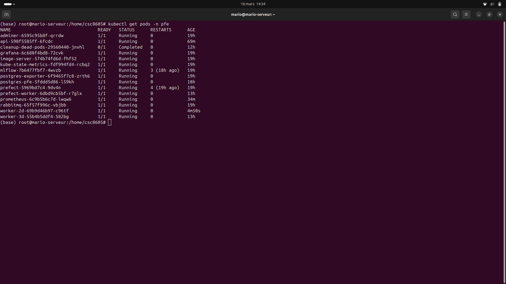
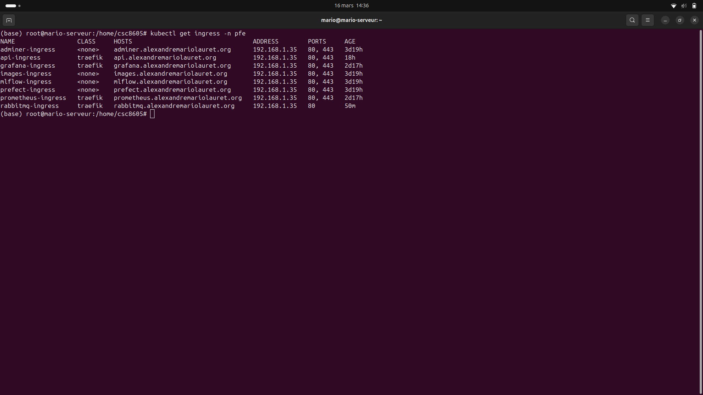
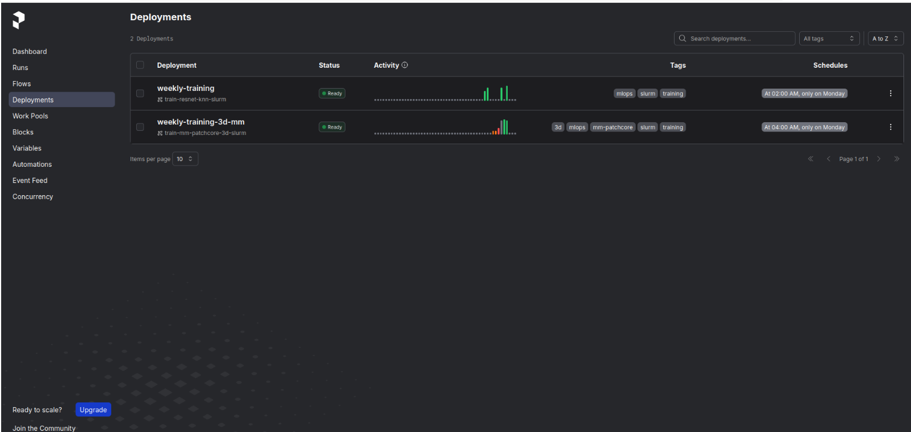

# Kubernetes & Prefect — Déploiement et Orchestration

Manifestes Kubernetes pour le déploiement de l'ensemble de la plateforme sur **k3s**, et flows **Prefect** pour l'orchestration des pipelines d'entraînement.

---

## Infrastructure Kubernetes

L'ensemble des services s'exécute dans le namespace `pfe` sur un cluster **k3s** (distribution légère de Kubernetes) avec **Traefik** comme Ingress Controller et **cert-manager** pour les certificats TLS.

### Pods déployés

| Pod | Image | Port | Rôle |
|-----|-------|------|------|
| `api` | `laurealdente/api:v8` | 8000 | API REST FastAPI |
| `worker-2d` | `laurealdente/worker-2d:latest` | 8080 | Inférence PatchCore 2D |
| `worker-3d` | `laurealdente/worker-3d:v3` | 8080 | Inférence MM-PatchCore 3D |
| `rabbitmq` | `rabbitmq:3-management` | 5672/15672 | File de messages |
| `postgres-pfe` | `postgres:15` | 5432 | Base de données |
| `mlflow` | `ghcr.io/mlflow/mlflow:v2.x` | 5000 | Tracking ML + Model Registry |
| `prefect` | `prefecthq/prefect:2-python3.11` | 4200 | Serveur d'orchestration |
| `prefect-worker` | `laurealdente/prefect-worker:v15` | — | Agent d'exécution des flows |
| `grafana` | `grafana/grafana:latest` | 3000 | Dashboards de monitoring |
| `prometheus` | `prom/prometheus:latest` | 9090 | Collecte de métriques |
| `kube-state-metrics` | `kube-state-metrics:v2.x` | 8080 | Métriques K8s |
| `postgres-exporter` | `prometheuscommunity/postgres-exporter` | 9187 | Métriques PostgreSQL |
| `image-server` | `nginx:alpine` | 80 | Serveur d'images statiques |
| `adminer` | `adminer:latest` | 8080 | Interface web PostgreSQL |

### Ingress (domaines)

| Domaine | Service | Port |
|---------|---------|------|
| `api.exemple.com` | api-service | 8000 |
| `mlflow.exemple.com` | mlflow-service | 5000 |
| `prefect.exemple.com` | prefect-service | 4200 |
| `grafana.exemple.com` | grafana-service | 3000 |
| `images.exemple.com` | image-server-service | 80 |




---

## Flows Prefect

### `training_flow_3d_mm.py`

Flow d'entraînement du Multimodal PatchCore, orchestré depuis Prefect et exécuté sur le cluster Slurm :

```
┌──────────────┐    ┌───────────────┐    ┌──────────────┐
│  Prefect UI  │──▶ │  Flow Python  │──▶ │ Cluster Slurm│
│  (trigger)   │    │  (SSH + sbatch)│   │ (GPU job)    │
└──────────────┘    └───────┬───────┘    └──────┬───────┘
                            │                    │
                            │ poll squeue        │ train
                            │◀───────────────────│
                            │                    │
                            │ run complete       │ log → MLflow
                            └────────────────────┘
```

Le flow :
1. Se connecte au cluster Slurm via SSH (jump host `ssh.imtbs-tsp.eu`)
2. Soumet le job d'entraînement avec `sbatch`
3. Surveille l'état du job par polling de `squeue` toutes les 30 secondes
4. Reporte le résultat (succès/échec) dans l'interface Prefect

### Déploiement Prefect

```yaml
# prefect.yaml (extrait)
deployments:
  - name: mm-patchcore-slurm
    entrypoint: flows/training_flow_3d_mm.py:training_flow_3d_mm
    work_pool_name: pfe-pool
```

### Lancer un entraînement via Prefect

```bash
# Depuis l'UI Prefect
# → https://prefect.exemple.com
# → Deployments → mm-patchcore-slurm → Run

# Ou en ligne de commande
prefect deployment run 'training-flow-3d-mm/mm-patchcore-slurm'
```




---

## Structure

```
k8s
├── adminer
│   ├── adminer_deployment.yaml
│   ├── adminer_ingress.yaml
│   └── adminer_service.yaml
├── api
│   ├── api-3d_deployment.yaml
│   ├── api-3d_ingress.yaml
│   ├── api-3d_service.yaml
│   ├── api_deployment.yaml
│   ├── api_ingress.yaml
│   └── api_service.yaml
├── configmap
│   ├── cm-api-3d.yaml
│   ├── cm-api.yaml
│   ├── cm-worker-3d.yaml
│   └── cm.yaml
├── cronjob
│   └── cronjob.yaml
├── grafana
│   ├── configmap.yaml
│   ├── grafana_deployment.yaml
│   ├── grafana_ingress.yaml
│   ├── grafana_persistent.yaml
│   └── grafana_service.yaml
├── images
│   ├── images_deployment.yaml
│   ├── image-server-service.yaml
│   └── images_ingress.yaml
├── mlflow
│   ├── mlflow_deployment.yaml
│   ├── mlflow_hpa.yaml
│   ├── mlflow_ingress.yaml
│   ├── mlflow_persistent.yaml
│   └── mlflow_service.yaml
├── postgres
│   ├── postgres_deployment.yaml
│   ├── postgres_ingress.yaml
│   └── postgres_service.yaml
├── prefect
│   ├── Dockerfile
│   ├── flows
│   │   ├── __init__.py
│   │   ├── training_flow_3d_mm.py
│   │   └── training_flow.py
│   ├── prefect_deployment.yaml
│   ├── prefect_hpa.yaml
│   ├── prefect_ingress.yaml
│   ├── prefect_service.yaml
│   ├── prefect-worker_deployment.yaml
│   ├── prefect.yaml
│   └── requirements.txt
├── prometheus
│   ├── configmap.yaml
│   ├── exporters.yaml
│   ├── prometheus_deployment.yaml
│   ├── prometheus_ingress.yaml
│   ├── prometheus_persistent.yaml
│   └── prometheus_service.yaml
├── rabbitmq
│   ├── rabbitmq_deployment.yaml
│   └── rabbitmq_service.yaml
├── README.md
└── worker
    ├── worker-2d_deployment.yaml
    ├── worker-2d_service.yaml
    ├── worker-3d_deployment.yaml
    └── worker-3d_service.yaml
```

---

## Commandes utiles

```bash
# Voir l'état de tous les pods
kubectl get pods -n pfe

# Logs d'un pod en temps réel
kubectl logs -f deployment/api -n pfe

# Redémarrer un deployment
kubectl rollout restart deployment/worker-3d -n pfe

# Mettre à jour une image
kubectl set image deployment/api api=laurealdente/api:v9 -n pfe
```
