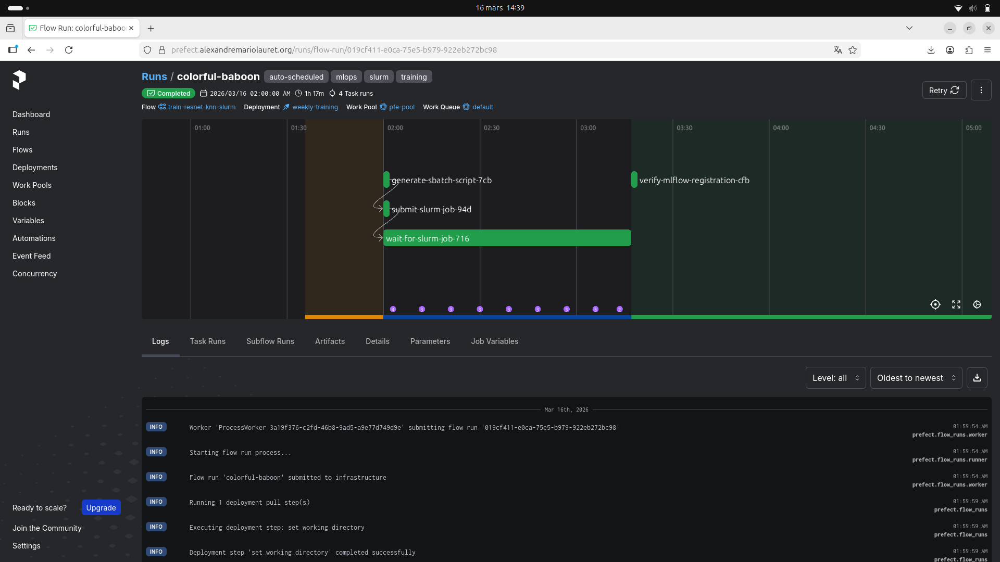

# Slurm — Entraînement HPC

Scripts pour lancer les entraînements sur le **cluster HPC** de l'école via le gestionnaire de jobs **Slurm**. L'entraînement des modèles PatchCore et Multimodal PatchCore nécessite un GPU pour l'extraction de features (ResNet18), ce qui justifie le déport sur le cluster de calcul.

---

## Accès au cluster

```bash
# Connexion via jump SSH
ssh alauret@ssh.imtbs-tsp.eu    # passerelle
ssh 157.159.104.128              # nœud de calcul
cd /mnt/hdd/homes/alauret/csc8605
```

---

## Scripts

### `setup_env.sh`

Prépare l'environnement conda et installe les dépendances :

```bash
source slurm/setup_env.sh
```

Ce script crée/active l'environnement conda `pfe`, installe les packages nécessaires (PyTorch, torchvision, MLflow, tifffile, scikit-learn, etc.) et charge les variables d'environnement depuis le `.env`.

### `fit_job.sh` — Entraînement 2D (PatchCore ResNet18)

```bash
# Toutes les catégories MVTec AD
sbatch slurm/fit_job.sh

# Une catégorie spécifique
sbatch slurm/fit_job.sh bottle
sbatch slurm/fit_job.sh metal_nut
```

Lance `python -m training.src fit` sur le dataset MVTec AD (15 catégories). Le modèle est sauvegardé dans `models/resnet_knn_2d_v1/` et enregistré dans MLflow.

### `fit_mm_job.sh` — Entraînement 3D (Multimodal PatchCore)

```bash
# Toutes les catégories MVTec 3D-AD
sbatch slurm/fit_mm_job.sh

# Une catégorie spécifique
sbatch slurm/fit_mm_job.sh bagel
sbatch slurm/fit_mm_job.sh cable_gland
```

Lance `python -m training_3d.src fit-mm` sur le dataset MVTec 3D-AD (10 catégories, RGB + Depth). Paramètres : image_size=224, coreset=60 000 patchs par modalité, alpha=0.5/0.5. Le modèle est sauvegardé dans `models/mm_patchcore_3d_all_v1/` et enregistré dans MLflow.

### Ressources demandées (les deux jobs)

| Paramètre | Valeur |
|-----------|--------|
| GPU | 1 |
| CPUs | 8 |
| Mémoire | 32 Go |
| Temps max | 4 heures |
| Partition | `gpu` |

---

## Suivi du job

```bash
# Vérifier l'état du job
squeue -u alauret

# Consulter les logs en temps réel
tail -f logs/fit_mm_3d_<JOB_ID>.out

# Les résultats apparaissent aussi dans MLflow :
# → https://mlflow.alexandremariolauret.org
```

---

## Orchestration via Prefect

L'entraînement peut également être déclenché via **Prefect** qui se charge de :
1. Se connecter au cluster Slurm par SSH
2. Soumettre le job (`sbatch`)
3. Suivre l'avancement (polling de `squeue`)
4. Reporter le statut final dans l'interface Prefect

Voir `k8s/prefect/flows/` pour les flows Prefect.



---

## Structure

```
slurm/
├── fit_job.sh       # Job Slurm — entraînement 2D (PatchCore)
├── fit_mm_job.sh    # Job Slurm — entraînement 3D (MM-PatchCore)
├── setup_env.sh     # Setup de l'environnement conda
└── README.md
```