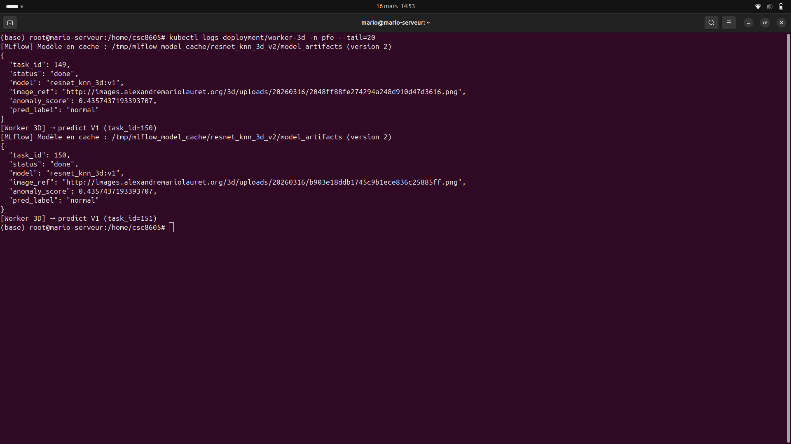

# Worker 3D — Inférence Multimodal PatchCore

Worker asynchrone consommant les tâches de prédiction **3D** depuis la file RabbitMQ `tasks_3d`. Ce worker charge le modèle **Multimodal PatchCore** depuis le registre MLflow, effectue l'inférence combinant les informations RGB et profondeur, et met à jour la tâche en base PostgreSQL.

---

## Architecture

```
RabbitMQ (tasks_3d)                              PostgreSQL
       │                                              ▲
       │ consume                              update  │
       ▼                                              │
┌──────────────────────────────────────────────────────┤
│                   Worker 3D                          │
│                                                      │
│  ┌────────────────┐    ┌──────────────────────────┐  │
│  │ Queue Consumer  │──▶│  cmd_predict (main.py)   │  │
│  │ (pika)         │    │  ├─ load MM-PatchCore    │  │
│  └────────────────┘    │  │    (rgb_bank + depth)  │  │
│                        │  ├─ predict (score RGB    │  │
│  ┌────────────────┐    │  │    + score Depth)      │  │
│  │ HTTP Server     │   │  ├─ late fusion (α=0.5)  │  │
│  │ :8080           │   │  └─ write result          │  │
│  │ /health         │   └──────────────────────────┘  │
│  │ /reload-model   │                                 │
│  │ /metrics        │        MLflow Registry          │
│  └────────────────┘         (mm_patchcore_3d)        │
│                                    ▲                  │
│                              load  │                  │
│                              model │                  │
└────────────────────────────────────┴──────────────────┘
```

Le worker charge automatiquement la version **Production** du modèle `mm_patchcore_3d` depuis MLflow au premier appel, avec mise en cache locale pour les appels suivants.

---

## Structure

```
worker_3d/
├── app_src/
│   ├── app/
│   │   ├── main.py              # Logique métier (cmd_predict)
│   │   ├── queue_consumer.py    # Consumer RabbitMQ (queue: tasks_3d)
│   │   ├── server.py            # Serveur HTTP admin (health, reload, metrics)
│   │   ├── inference.py         # MM-PatchCore : chargement modèle, prédiction
│   │   ├── data.py              # Chargement images + depth maps (HTTP + cache)
│   │   ├── config.py            # Configuration (Settings depuis YAML)
│   │   ├── db.py                # Accès PostgreSQL
│   │   └── io_utils.py          # Écriture résultats
│   ├── conf/
│   │   └── config.yaml          # Configuration embarquée
│   ├── Dockerfile
│   └── requirements.txt
└── README.md
```

---

## Endpoints d'administration

| Méthode | Route | Description |
|---------|-------|-------------|
| `GET` | `/health` | Statut du worker, version du modèle en cache, état MLflow |
| `POST` | `/reload-model` | Invalider le cache modèle (force le re-téléchargement) |
| `POST` | `/reload-model?force=true` | Supprimer tout le cache, y compris la version courante |
| `GET` | `/metrics` | Métriques Prometheus |

---

## Métriques Prometheus

| Métrique | Type | Description |
|----------|------|-------------|
| `worker3d_tasks_processed_total` | Counter | Tâches traitées par statut (done/failed) |
| `worker3d_task_duration_seconds` | Histogram | Durée de traitement par tâche |
| `worker3d_anomaly_score` | Histogram | Distribution des scores d'anomalie 3D |
| `worker3d_model_cache_version` | Gauge | Version du modèle MM-PatchCore en cache |

---

## Build et déploiement

```bash
cd worker_3d/app_src/
docker build -t laurealdente/worker-3d:v3 .
docker push laurealdente/worker-3d:v3

kubectl set image deployment/worker-3d worker-3d=laurealdente/worker-3d:v3 -n pfe
```

---

## Variables d'environnement

| Variable | Description | Défaut |
|----------|-------------|--------|
| `MLFLOW_TRACKING_URI` | URL du serveur MLflow | `http://mlflow-service:5000` |
| `MLFLOW_MODEL_NAME` | Nom du modèle dans le registry | `mm_patchcore_3d` |
| `MODEL_CACHE_DIR` | Répertoire de cache local des modèles | `/tmp/mlflow_model_cache` |
| `USE_MLFLOW_REGISTRY` | Charger le modèle depuis MLflow | `true` |
| `TASK_TABLE` | Table PostgreSQL des tâches | `tasks_3d` |

---

## Cycle de vie du modèle

```
MLflow UI ──promouvoir──▶ mm_patchcore_3d@production
                              │
API ──POST /admin/reload-model/3d──▶ Worker 3D ──vide cache
                                         │
                              Prochaine tâche ──▶ télécharge la nouvelle version
                                                  depuis MLflow → cache local
```

